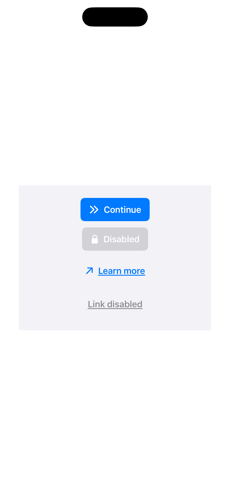
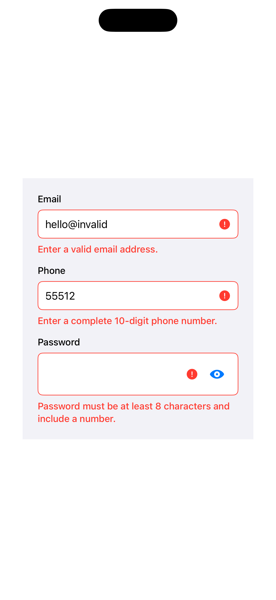
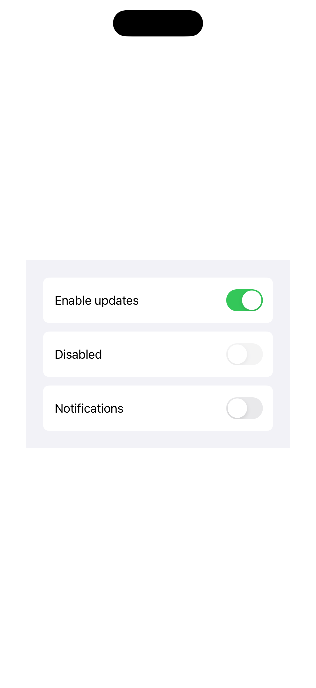

# GlobalDesignSystem

Global Design System for iOS built with SwiftUI.

## Getting Started

Import the `Global Design System` package and optionally inject a custom theme at the app:

```swift
import SwiftUI
import GlobalDesignSystem

struct TenantTheme: GDSTheme {
    let color = GDSDefaultTheme().color
    let spacing = GDSDefaultTheme().spacing
    let typography = GDSDefaultTheme().typography
}

@main
struct DemoAppApp: App {
    var body: some Scene {
        WindowGroup {
            RootView()
                .gdsTheme(TenantTheme())
        }
    }
}
```

If no theme is injected, components fall back to `GDSDefaultTheme()`.

## Themes and Tokens

Every component reads its styling from the active `GDSTheme`.

- `color`, `spacing` & `typography`

## Accessibility

- The component layer is built with accessibility in mind.
- The default components aim for WCAG.

## Components

### GDSButton

Supports `filled` and `link` variants, with optional leading icon.

```swift
VStack(spacing: 12) {
    GDSButton(title: "Continue") {
        submit()
    }

    GDSButton(
        variant: .link,
        title: "Forgot password?",
        icon: Image(systemName: "arrow.right")
    ) {
        showResetFlow()
    }
}
```

### GDSTextField

Supports `email`, `phone`, and `password` field types. Validation is built in through `GDSTextFieldValidator`.

```swift
struct FormView: View {
    @State private var email = ""
    @State private var phone = ""
    @State private var password = ""

    var body: some View {
        VStack(spacing: 16) {
            GDSTextField(type: .email, text: $email) // `email` validates against a standard email pattern.
            GDSTextField(type: .phone, text: $phone) // `phone` normalizes user input to digits and expects a complete 10-digit number.
            GDSTextField(type: .password, text: $password)
        }
    }
}
```

Use a custom password rule if needed:

```swift
GDSTextField(
    type: .password,
    text: $password,
    validator: GDSTextFieldValidator(minimumPasswordLength: 12)
)
```

### GDSToggleSwitch

Wrapper for SwiftUI `Toggle` with design-system spacing, typography, and color tokens.


```swift
struct PreferencesView: View {
    @State private var marketingOptIn = true

    var body: some View {
        GDSToggleSwitch(
            isOn: $marketingOptIn,
            title: "Receive product updates"
        )
    }
}
```

## Previews
| GDSButton | GDSTextField | GDSToggleSwitch |
| :---: | :---: | :---: |
|  |  |  |

## Testing

There are two testing layers:

- Unit tests for validation and small state logic.
- UI tests against the demo app for interaction flows and accessibility states.

>Note: I've also looked into snapshot testing for the design system components. However, due to strict "no third-party libraries" requirement, I have not committed those changes

## Demo App
- Demo app helps to quickly explore the Design System and understand the available components.
  |Demo|
  |:-:|
  ||


